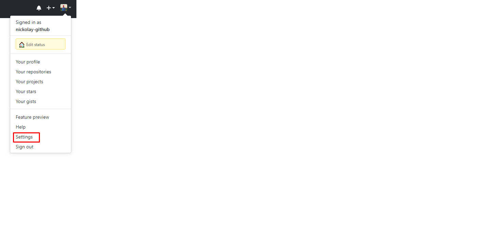
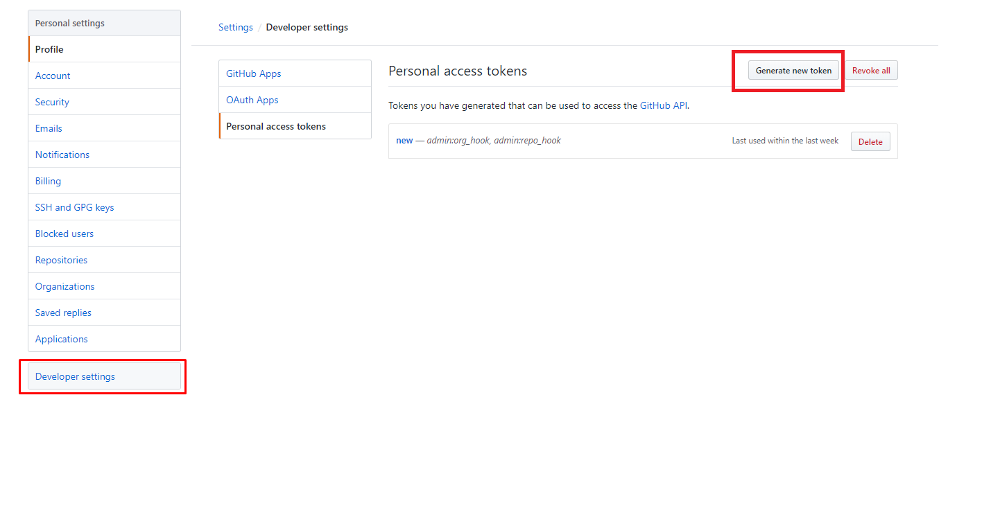
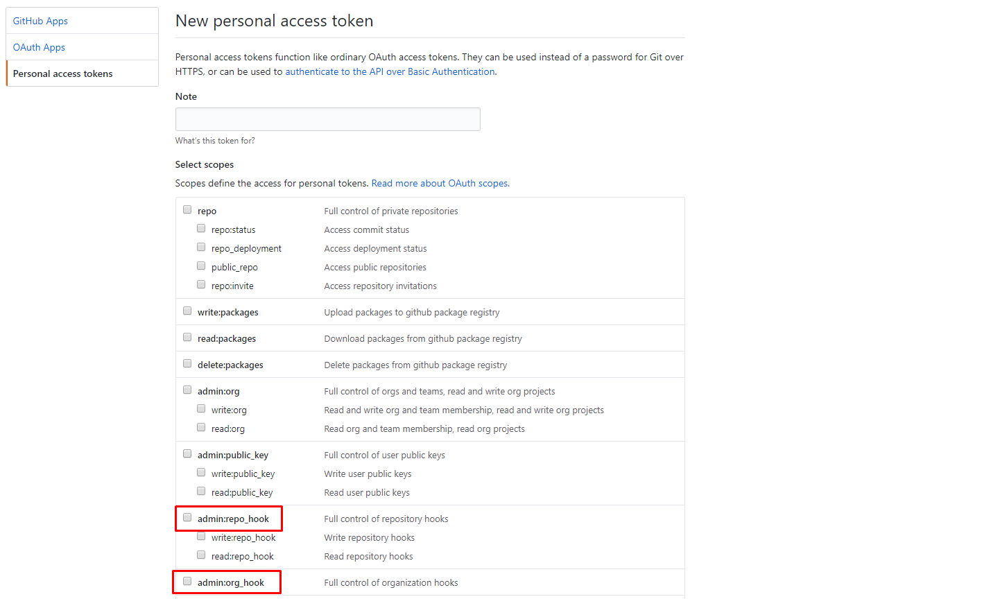

# How to subscribe to repository updates

To subscribe to repository updates, you must have ***administrator*** rights for this repository (if the repository is inside the organization,
 have the status of the ***owner*** of the organization).  
The bot creates a github webhook in the repository and catches events. 
To create a web hook, the bot must have a token with certain access rights. 

Instructions
---
* Create a personal access token on the settings page of your account.  
To do this, go to your account settings, go to the `Developer Settings` tab. After that, go to the `Personal access tokens` tab and click the `Create new token` button.
Next, enter the token name and determine the access level: here you need to choose the options *admin: repo_hook* and *admin: org_hook* (if you want to subscribe to the repositories of your organization).
A token will be created, and you need to copy it to your computer.

* Transfer the generated token to the bot. To do this, send the ***`/set_token`*** command to the bot, enter the name of your account and after - the token.

Well done! Now you can subscribe to the events of your repositories.

P.S
---
If you successfully entered the token and subscribed to the repository (that is, a web hook was created using the bot for the repository), the repository is considered open to subscribers.  
This means that ***any users*** can subscribe to updates of this repository without entering a token.

Help screenshots
---

  `Settings` button

  `Developers settings` -> Generate new token

  Define token scopes